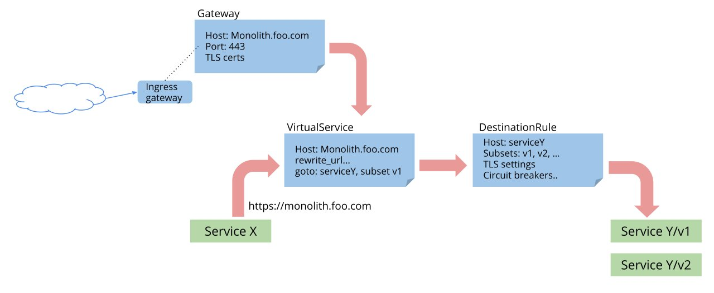

# service-mesh-hands-on

## Prerequisite
- [kubectl](https://kubernetes.io/docs/tasks/tools/install-kubectl-linux/)
- [eksctl](https://docs.aws.amazon.com/eks/latest/userguide/eksctl.html)
- [helm](https://helm.sh/docs/intro/install/)
- [istioctl](https://istio.io/latest/docs/setup/getting-started/#download)
- [aws-load-balancer-controller](https://github.com/aws/eks-charts/tree/master/stable/aws-load-balancer-controller)
- [k9s](https://k9scli.io/topics/install/) (Optional)
- EKS Cluster
```bash
# Create EKS Cluster
eksctl create cluster -f eksctl/cluster.yaml

# Create Kubeconfig
aws eks update-kubeconfig --name ###CLUSTER_NAME### --region ap-northeast-2 --role-arn ###IAM_ROLE_ARN###
```
- Sample App
```
kubectl apply -f color-service.yaml
```


## Istio

> Did you know?
> Istio means "Sail" in Greek





### 1. Install Istio using default profile
```bash
istioctl install --set profile=default -y 
```

### 2. Enable Sidecar injection and Install AddOns
```
# Enable sidecar injection
kubectl label namespace default istio-injection=enabled

# Prometheus
kubectl apply -f https://raw.githubusercontent.com/istio/istio/master/samples/addons/prometheus.yaml

# Grafana
kubectl apply -f https://raw.githubusercontent.com/istio/istio/master/samples/addons/grafana.yaml

# Jaeger
kubectl apply -f https://raw.githubusercontent.com/istio/istio/master/samples/addons/jaeger.yaml

# Kiali
kubectl apply -f https://raw.githubusercontent.com/istio/istio/master/samples/addons/kiali.yaml
```

### 3. Install Gateway
```
kubectl apply -f istio/01_gateway.yaml
```

### 4. Install VirtualService
```
kubectl apply -f istio/02_virtualservice.yaml
```

### 5. Install DestinationRule
```
kubectl apply -f istio/03_destinationrule.yaml
```

### 6. Test Traffic Routing
```
while sleep 2; do curl ###YOUR_ALB_DNS_NAME###; done
```


## AWS App Mesh


### 1. Install App Mesh Controller
```bash
helm repo add eks https://aws.github.io/eks-charts
kubectl apply -k "https://github.com/aws/eks-charts/stable/appmesh-controller/crds?ref=master"
kubectl create ns appmesh-system

# Replace 'cluster-name' and 'region-code'
export CLUSTER_NAME=cluster-name
export AWS_REGION=region-code

eksctl create iamserviceaccount \
    --cluster $CLUSTER_NAME \
    --namespace appmesh-system \
    --name appmesh-controller \
    --attach-policy-arn  arn:aws:iam::aws:policy/AWSCloudMapFullAccess,arn:aws:iam::aws:policy/AWSAppMeshFullAccess \
    --override-existing-serviceaccounts \
    --approve
    
    
helm upgrade -i appmesh-controller eks/appmesh-controller \
    --namespace appmesh-system \
    --set region=$AWS_REGION \
    --set serviceAccount.create=false \
    --set serviceAccount.name=appmesh-controller
```

### 2. Deploy App Mesh resources
```
kubectl apply -f appmesh/01_namespace.yaml
kubectl apply -f appmesh/02_mesh.yaml
kubectl apply -f appmesh/03_virtualnode.yaml
kubectl apply -f appmesh/04_virtualrouter.yaml
```

### 3. Install Gateway
```
kubectl apply -f istio/02_gateway.yaml
```

### 4. Install VirtualService
```
kubectl apply -f istio/03_virtualservice.yaml
```

### 5. Install DestinationRule
```
kubectl apply -f istio/04_destinationrule.yaml
```

### 6. Test Traffic Routing
```
while sleep 2; do curl ###YOUR_ALB_DNS_NAME###; done
```

